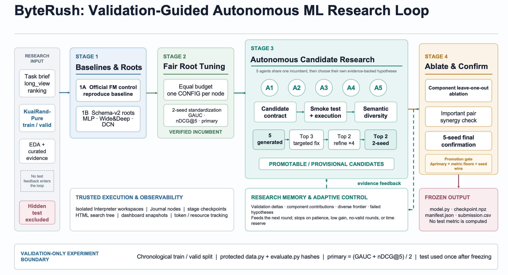

# ByteRush

ByteRush is an autonomous machine learning research agent for the KuaiRand-Pure short-video recommendation task. Built on AI Scientist-v2, it generates experimental candidates, runs recommendation-model experiments, compares validation results through a multi-stage search process, freezes the final model, and produces a validated submission file.

## 1. Project overview

This project studies within-user short-video ranking on KuaiRand-Pure. For every user, the model predicts a `long_view` score for each exposed video and ranks the videos by that score.

The project uses two official evaluation metrics:

- **GAUC:** evaluates the overall ordering of positive and negative examples within users;
- **nDCG@5:** evaluates whether relevant videos appear near the top five positions of each user's ranked list;
- **Primary score:** `(GAUC + nDCG@5) / 2`.

ByteRush organizes recommendation experiments into four stages, with an adaptive research loop between Stage 3 and Stage 4:

1. **Stage 1 / Stage 1B:** validate the FM baseline, then generate MLP, Wide & Deep, and DCN architecture roots;
2. **Stage 2:** tune the FM control and architecture roots under the same budget, compare them using two standardized random seeds, and select a verified incumbent;
3. **Stage 3:** launch five autonomous candidate slots per round, then run contract validation, smoke tests, tuning, refinement, and candidate selection;
4. **Stage 4:** run single-component and component-pair ablations on promoted candidates, followed by five-seed confirmation to determine whether a candidate can replace the incumbent.

The complete workflow is:

```text
Load the predefined research task and starting code
→ Stage 1: validate the FM baseline
→ Stage 1B: generate MLP, Wide & Deep, and DCN roots
→ Stage 2: tune all roots under the same budget and compare two-seed results
→ Stage 3: generate, validate, tune, and select five candidates in parallel
→ Stage 4: run component ablations and five-seed confirmation
→ update the incumbent using validation results
→ repeat Stage 3/4 until convergence, a patience limit, or the safe time limit
→ complete five-seed confirmation for the final incumbent
→ freeze the final model and automatically generate and validate submission.csv
```



*Figure 1. Overview of the validation-guided ByteRush research loop, from baseline reproduction and diverse model roots to autonomous candidate research, ablation, multi-seed confirmation, and final submission generation.*

### Final validation results

The final model was selected exclusively from validation results. Relative to the official FM baseline, the selected Wide & Deep model improved both ranking components and the combined primary score:

| Model | GAUC | nDCG@5 | Primary |
|---|---:|---:|---:|
| Official FM baseline | 0.667366 | 0.535944 | 0.601655 |
| Selected Wide & Deep model | **0.671028** | **0.537670** | **0.604349** |
| Absolute improvement | **+0.003662** | **+0.001726** | **+0.002694** |

These values are validation metrics; the hidden test set was not used for model selection or metric feedback.

The repository includes the compact evidence for the completed Stage 1–4 run `2026-08-31_18-02-46_kuairand_fm_validation_baseline_attempt_0` under `results/runs/`. Interrupted runs, failed candidate workspaces, caches, and redundant checkpoints are excluded. The submission-ready Wide & Deep package is stored in `results/final_model/`; it was reconstructed from the preserved successful Stage 4 source, best-seed checkpoint, and five-seed validation records after the shared working artifact directory was reused by later experiments.

The project uses only the official KuaiRand-Pure data for training and validation. The test split is used only to produce predictions from the final frozen model. Test labels and test metrics are never exposed to the research agent.

The main directories and files are:

```text
ByteRush/
├── ai_scientist/ideas/
│   ├── kuairand_ranking.json        # Research task used by the agent
│   └── kuairand_ranking.py          # Starting experiment code
├── ai_scientist/treesearch/
│   ├── agent_manager.py             # Agent and stage entry point
│   ├── closed_loop.py               # Adaptive Stage 1–4 orchestration
│   ├── research_loop.py             # State, promotion, and stopping logic
│   ├── candidate_contract.py        # Candidate-code contract validation
│   ├── parallel_agent.py            # Parallel candidate execution
│   └── finalize.py                  # Final-model freezing
├── kuairand-starter-kit/
│   ├── data.py                      # KuaiRand-Pure loading and splits
│   ├── evaluate.py                  # GAUC and nDCG@5 evaluation
│   ├── run_fm_experiment.py         # Controlled FM experiment entry point
│   ├── submit.py                    # Submission generation and validation
│   └── export_best_submission.py    # Export from a frozen checkpoint
├── dashboard/                       # Experiment-result dashboard
├── results/                         # Curated successful run and final Wide & Deep package
│   ├── runs/                        # Compact Stage 1–4 search evidence
│   └── final_model/                 # Source, checkpoint, manifest, and submission
├── reports/                         # Run records and result summaries
├── tests/                           # Closed-loop, candidate, and freeze tests
├── artifacts/                       # Frozen models and research state
├── deployment_runs/                 # Smoke-test workspaces
├── logs_stage4/                     # Agent and stage logs
├── workspaces_stage4/               # Isolated candidate workspaces
├── bfts_config_kuairand.yaml        # Stage 1–4 configuration
├── launch_scientist_bfts.py         # Full agent workflow entry point
├── run_v2_fm_smoke.py               # V2 → FM pipeline smoke test
└── requirements_kuairand.txt        # Python dependencies
```

## 2. Setup and installation instructions

### 2.1 Verified environment

The complete workflow was validated in the following reference environment:

- Ubuntu 22.04.4 LTS;
- Python 3.12.3;
- PyTorch 2.5.1+cu124;
- NVIDIA GeForce RTX 3080 Ti;
- `tmux` for persistent long-running experiment sessions.

The NVIDIA GeForce RTX 3080 Ti is not a strict requirement. The workflow can run on another CUDA-capable GPU with sufficient memory and a compatible PyTorch build. CPU execution is also supported by the model code, although a full autonomous search is expected to be substantially slower. Other Linux, Python, and CUDA combinations may work but were not used for the reported experiments.

### 2.2 Clone the repository and install dependencies

```bash
git clone https://github.com/yurunzzz/ByteRush--TechJam.git
cd ByteRush--TechJam

conda create -n byterush python=3.12 -y
conda activate byterush

python -m pip install --upgrade pip
python -m pip install -r requirements_kuairand.txt
```

PyTorch is intentionally not included in `requirements_kuairand.txt` because the installed build must match the host CUDA version. If PyTorch is not already available, install a compatible build for the machine's CUDA environment.

Check PyTorch and GPU availability:

```bash
python -c "import torch; print('PyTorch:', torch.__version__); print('CUDA available:', torch.cuda.is_available())"
```

### 2.3 Download KuaiRand-Pure

The Git repository does not contain the raw dataset. Before running the pipeline, download and extract KuaiRand-Pure from its official release:

```bash
cd kuairand-starter-kit

wget https://zenodo.org/records/10439422/files/KuaiRand-Pure.tar.gz
tar -xzf KuaiRand-Pure.tar.gz

cd ..
```

After extraction, the data directory must be:

```text
kuairand-starter-kit/KuaiRand-Pure/data/
```

It must contain at least:

```text
log_standard_4_08_to_4_21_pure.csv
log_standard_4_22_to_5_08_pure.csv
video_features_basic_pure.csv
```

Check that the required data is available:

```bash
test -f kuairand-starter-kit/KuaiRand-Pure/data/log_standard_4_08_to_4_21_pure.csv \
  && test -f kuairand-starter-kit/KuaiRand-Pure/data/log_standard_4_22_to_5_08_pure.csv \
  && test -f kuairand-starter-kit/KuaiRand-Pure/data/video_features_basic_pure.csv \
  && echo "KuaiRand-Pure data ready"
```

### 2.4 Configure the OpenAI API and models

Set `OPENAI_API_KEY` in the shell used to run the agent. Never write a real API key into the source code or commit one to GitHub.

```bash
export OPENAI_API_KEY="your-openai-api-key"
```

Check whether the key is loaded without printing the key itself:

```bash
python -c "import os; print('OpenAI key loaded:', bool(os.getenv('OPENAI_API_KEY')))"
```

Configure the model used by each agent role:

```bash
export AI_SCIENTIST_CODE_MODEL=gpt-5.6-sol
export AI_SCIENTIST_FEEDBACK_MODEL=gpt-5.6-terra
export AI_SCIENTIST_SUMMARY_MODEL=gpt-5.6-terra
export AI_SCIENTIST_SELECT_MODEL=gpt-5.6-terra
export AI_SCIENTIST_VLM_MODEL=gpt-5.6-luna
export AI_SCIENTIST_REPORT_MODEL=gpt-5.6-luna
```

These variables control code generation, experiment feedback, experiment summaries, node selection, visual feedback, and report generation, respectively.

### 2.5 Create a tmux session

The full experiment may run for several hours. Run it inside `tmux`:

```bash
tmux new -s byterush
```

If the session already exists, reconnect with:

```bash
tmux attach -t byterush
```

Inside the session, move to the project directory and set the API key and model variables in the same shell:

```bash
cd /path/to/ByteRush
```

## 3. Steps to reproduce our results

Run all commands below from the repository root.

### 3.1 Run the automated test suite

Run the repository test suite before launching an experiment:

```bash
python -m unittest discover -s tests -p "test_*.py"
```

A successful run ends with `OK`.

### 3.2 Run the V2 → FM smoke test

Start with the standalone smoke test. It uses the AI Scientist-v2 `Interpreter` to execute the PyTorch FM starting code in `ai_scientist/ideas/kuairand_ranking.py` and verifies that:

- KuaiRand-Pure can be loaded;
- the V2 Interpreter can execute the candidate;
- `deployment_runs/v2_fm_baseline/working/experiment_data.npy` is created;
- the validation primary score is within the expected `0.59–0.61` range;
- `smoke_report.json` is written.

```bash
python run_v2_fm_smoke.py
```

A successful run ends with output similar to:

```text
V2_FM_SMOKE_RESULT {"status": "success", ...}
```

### 3.3 Configure the run log

Create a timestamped log path for the Stage 1–4 run:

```bash
export AGENT_RUN_LOG="/tmp/kuairand_agent_multiparent_$(date +%Y%m%d_%H%M%S).log"
echo "$AGENT_RUN_LOG"
```

Make the shell preserve the agent's actual exit status when output is piped through `tee`:

```bash
set -o pipefail
```

### 3.4 Run the complete Stage 1–4 workflow

`bfts_config_kuairand.yaml` enables `research_loop`. The command below therefore enters `ClosedLoopRunner` and executes Stage 1, Stage 1B, Stage 2, and the adaptive multi-round Stage 3/4 loop rather than a single linear four-stage pass.

```bash
python launch_scientist_bfts.py \
  --config bfts_config_kuairand.yaml \
  --load_ideas ai_scientist/ideas/kuairand_ranking.json \
  --load_code \
  --idea_idx 0 \
  --skip_plots \
  --skip_writeup \
  --skip_review \
  2>&1 | tee "$AGENT_RUN_LOG"
```

Arguments:

- `--config`: loads the KuaiRand Stage 1–4 configuration;
- `--load_ideas`: loads the predefined KuaiRand research task;
- `--load_code`: loads the starting code associated with that task;
- `--idea_idx 0`: runs the first task in the JSON file;
- `--skip_plots`, `--skip_writeup`, and `--skip_review`: run model experiments without producing plots, a paper, or a review.

The current configuration uses two parallel workers. The Stage 1/2/3/4 iteration ceilings are 2/2/30/15, Stage 3 has five autonomous candidate slots per round, the research loop allows up to ten rounds, and final confirmation uses five random seeds. The loop may stop earlier after repeated low-gain rounds, repeated rounds without valid candidates, or the safe wall-clock limit.

Print the saved log path:

```bash
echo "$AGENT_RUN_LOG"
```

Follow the log while the run is active:

```bash
tail -f "$AGENT_RUN_LOG"
```

### 3.5 Generate a submission from the frozen model

At the end of the closed loop, the system automatically confirms the final incumbent, freezes it, and generates a submission. The version-controlled final Wide & Deep package is:

```text
results/final_model
```

“Freezing” means that `finalize.py` selects the final candidate by mean validation primary across the required successful seeds and saves the following reproducible artifacts:

```text
model.py                  # Final candidate code
checkpoint.npz            # Parameters from the best confirmed seed
training_history.json     # Training history
manifest.json             # Source node, validation results, and hashes
source_node_id.txt        # Source-node identifier
submission.csv            # Test predictions
submission.csv.metadata.json
```

To manually regenerate the submission from an existing frozen model, run:

```bash
python kuairand-starter-kit/submit.py \
  results/final_model/submission.csv \
  --make-best \
  --artifact_dir results/final_model \
  --split test
```

`--make-best` verifies the SHA-256 hashes of `model.py` and `checkpoint.npz`, loads the frozen checkpoint in inference-only mode, and writes:

```text
results/final_model/submission.csv
```

The committed submission is available directly at `results/final_model/submission.csv`. The export does not retrain the model and does not compute or display test metrics. A newly executed research run may still write its working artifact to the `final_model_dir` configured in YAML; use `results/final_model/` to reproduce the version-controlled Wide & Deep result reported above.

### 3.6 Validate the submission independently

```bash
python kuairand-starter-kit/submit.py \
  results/final_model/submission.csv \
  --check \
  --split test \
  --data_dir kuairand-starter-kit/KuaiRand-Pure/data
```

Validation checks:

- the CSV header and file format;
- the number of test predictions;
- row-by-row alignment of `row_id`, `user_id`, and `video_id` with the official data order;
- whether every `score` is finite.

The required submission schema is:

```text
row_id,user_id,video_id,score
```

### 3.7 Launch the dashboard visualization

From the repository root, install the dashboard dependencies and start the Streamlit app:

```bash
python -m pip install -r dashboard/requirements.txt
python -m streamlit run dashboard/app.py \
  --server.address 127.0.0.1 \
  --server.port 8501 \
  --server.fileWatcherType none
```

Open <http://127.0.0.1:8501> in a browser. Press `Ctrl+C` in the terminal to stop the dashboard.

The dashboard presents our best model, metric improvements, Agent workflow, search process, and final verification results.

## 4. A brief reflection on our solution's limitations and what you would improve given more time

The current system has completed the full workflow from the smoke test and Stage 1/1B/2 through the adaptive Stage 3/4 loop, final-model freezing, and submission validation. However, it still has several limitations.

First, Stage 1B and Stage 3 depend on an LLM to generate and modify candidate code. Even with the same entry configuration, different API responses may produce different candidates, so the complete research trajectory is not fully deterministic. The current system saves candidate code, research state, checkpoints, and token records. Given more time, we would additionally pin model versions and store complete prompt/response replay packages so that candidate generation itself could be reproduced independently.

Second, the system repeatedly trains and compares architecture roots, Stage 3 candidates, ablation variants, and random seeds, resulting in substantial runtime and API usage. The current implementation already uses candidate budgets, smoke tests, patience conditions, and a safe wall-clock limit, but failed candidates still consume resources. Given more time, we would allocate budgets dynamically using historical failure rates, runtime, and validation gains, and expand the use of low-cost preflight tests.

Third, the remote run records contain cases in which a worker returned no candidate, a candidate violated the contract, a ranking objective did not construct same-user groups correctly, or a declared feature was not materially implemented. The current preflight checks, candidate contract, smoke test, and limited repair attempts prevent invalid candidates from being promoted. Given more time, we would add tensor-shape, gradient, and small-sample training tests, together with more targeted repair strategies for each failure category.

Fourth, the project has been validated only on the KuaiRand-Pure `long_view` within-user ranking task. Its data contract, candidate constraints, and evaluation interface are task-specific, so the current result does not establish performance on other recommendation datasets or tasks. Given more time, we would first extract replaceable data-loading and evaluation interfaces and then evaluate the system on additional public recommendation tasks.

Fifth, the final model is selected using primary score on a fixed validation split. Validation labels are never used as model features, and test metrics are explicitly prohibited, but repeated comparison can still introduce validation-selection bias. Two-seed standardization, five-seed final confirmation, component-regression limits, and ablations reduce but do not eliminate this risk. Given more time, we would add rolling temporal validation within the permitted training period and compare candidates over more random seeds.

Finally, the raw KuaiRand-Pure data, experiment workspaces, and model checkpoints are not included in the public Git repository. Reproduction therefore requires a separate data download and a new experiment run. Given more time, we would provide a one-command data downloader with checksum validation, a fully locked environment file, and a unified reproduction script covering the smoke test through submission generation.

## 5. Team contributions and acknowledgements

This project was developed collaboratively, primarily through a shared remote server. As a result, Git commit identities and commit counts do not accurately reflect each member's actual contribution. We gratefully acknowledge every team member:

- **Jiang Yushan:** coordinated team responsibilities, analyzed the challenge requirements, managed project progress and remote-server resources, and contributed run logging, code-difference tracking, reliability testing, and the terminal demonstration experience;
- **Zhang Yurun:** led the overall integration of AI Scientist with KuaiRand, developed the research feedback loop, and contributed the trusted experiment and final-submission pipelines;
- **Lepeng Wang:** developed the agent-stage orchestration, candidate-model contracts, closed-loop search, parallel execution, and core test suite;
- **Xie Maonan:** conducted KuaiRand data analysis and research-prior preparation, verified experimental results, and organized the competition documentation and final deliverables;
- **Lu Yujing:** conducted the initial literature review, managed API access, organized the README, and developed the experiment dashboard, data-loading components, and snapshot presentation.
